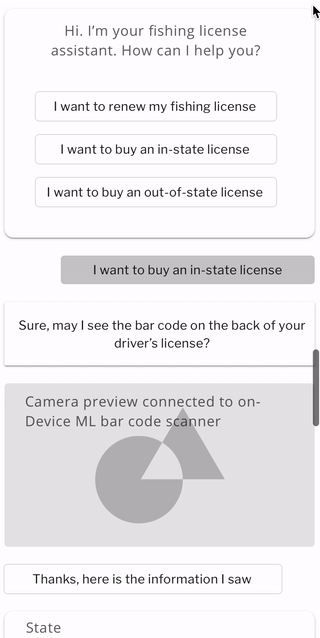

# Fishing License Assistant

An app to assist you when buying or renewing your fishing license online.

## Introduction

The Fishing License Assistant app will use computer vision and machine learning to simplify renewing or buying your fishing license online.
Instead of filling out a long and complicated web form on a site not optimized for mobile.
Have a conversation with the app.
It will ask to see your previous fishing license if you are renewing or your driver’s license if you are buying your first fishing license.
Then the app will attempt to fill out the needed info to complete the transaction for you.
If any additional info is needed, the app will ask a few additional questions to gather more information and try again.

#### Live Demo
<https://appetize.io/embed/wb152rhfzh5gb1mmvyxuw218t4?device=nexus5&scale=75&orientation=portrait&osVersion=8.1>

### UI mockup: Renewing your license

### UI mockup: Purchasing your license

